# CoachZen

Welcome to **CoachZen** - a powerful and intuitive Customer Relationship Management (CRM) system designed specifically for health and wellness coaches. Built with Flutter and Firebase, CoachZen offers a stunning UI and an easy-to-use interface to help you streamline your coaching business.

## Features

CoachZen assists you at every stage of your coaching journey, from initial contact to final sale, ensuring seamless management of leads, clients, and sales pipelines. Our CRM system empowers you to focus on what you do best: coaching. Here’s what you can manage with CoachZen:

- **Data Management:** Organize and maintain detailed records of your clients.
- **Orders and Invoices:** Handle billing and payment processing with ease.
- **Weight and Measurements:** Track client progress with detailed logs.
- **Medical History:** Maintain comprehensive medical records securely.
- **Attendance:** Daily monitor many client attendance at once.
- **Daily Overviews:** Get a snapshot of your daily clients and retails.
- **And much more!**

## Why CoachZen?

CoachZen is tailored to meet the unique needs of health and wellness coaches, offering a suite of tools that simplifies client management and enhances your coaching efficiency. My user-friendly design ensures you spend less time on administrative tasks and more time helping your clients achieve their goals.

## Technology Stack

- **Flutter:** For a stunning and responsive user interface.
- **Firebase:** For robust and scalable backend services.

## Screenshots

Here are a few screenshots of CoachZen:

### Splash Screen
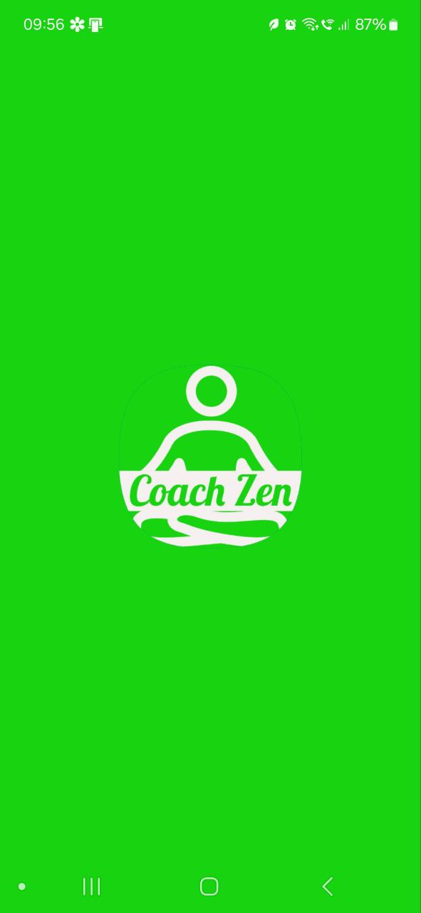

### Getting Started <small>(Old Title)</small>
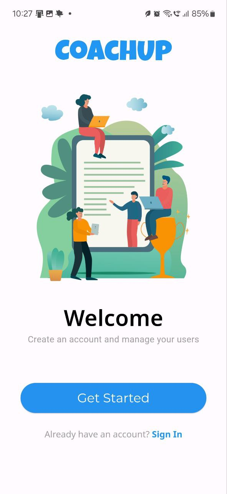

### Plan Ending Reminder
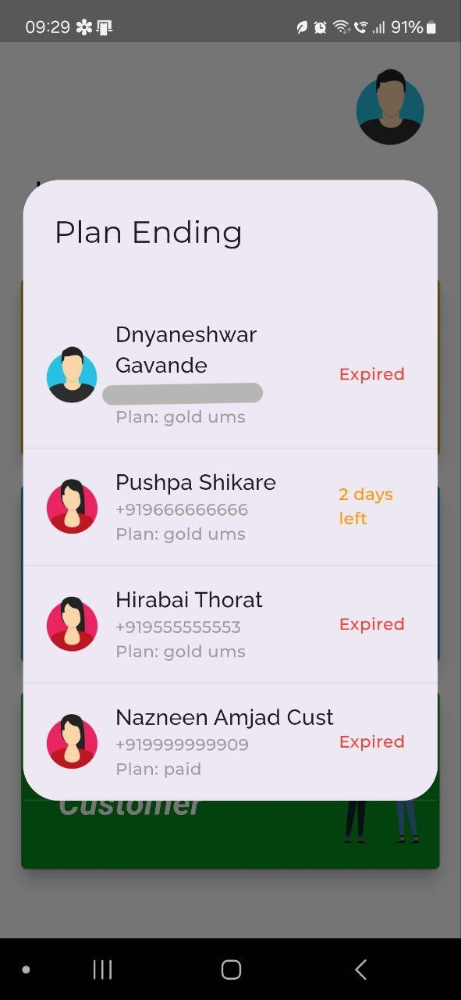

### Home Screen
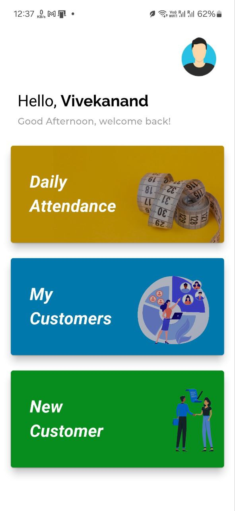

### Attendance
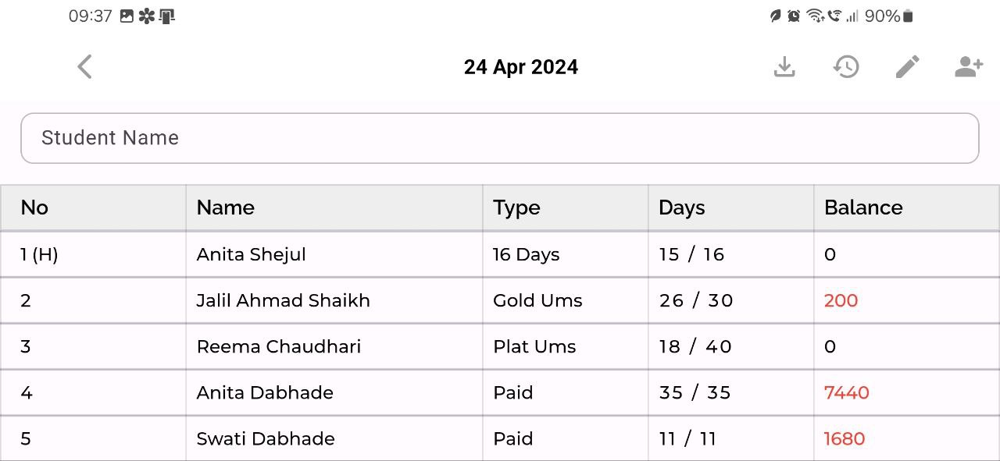

### Export to Excel
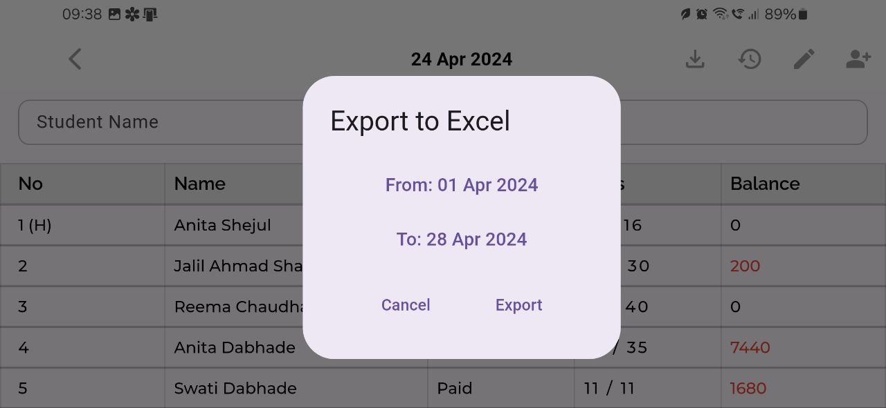

### Daily Overview
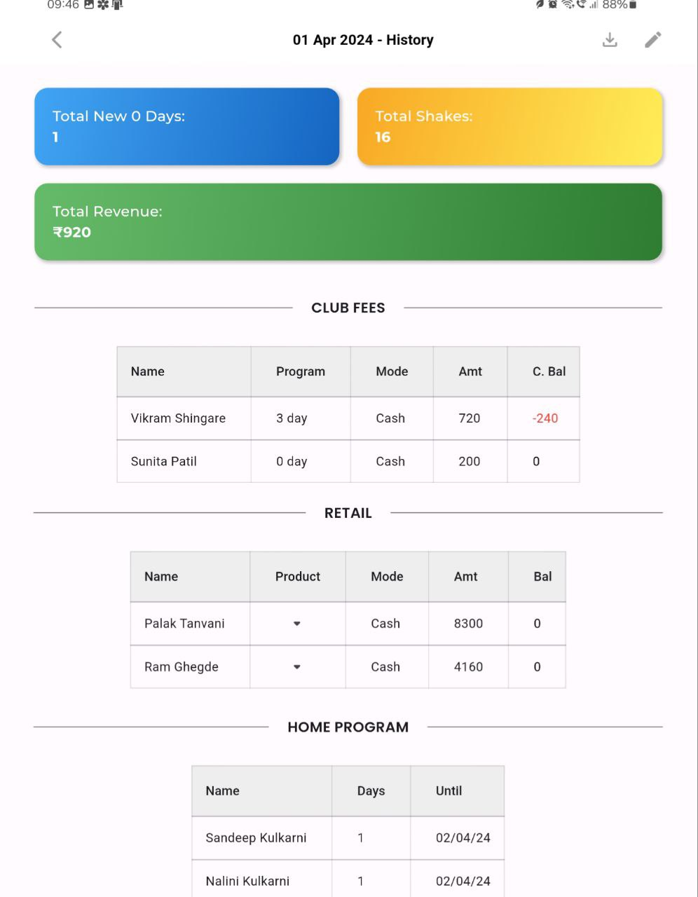

### Customer List
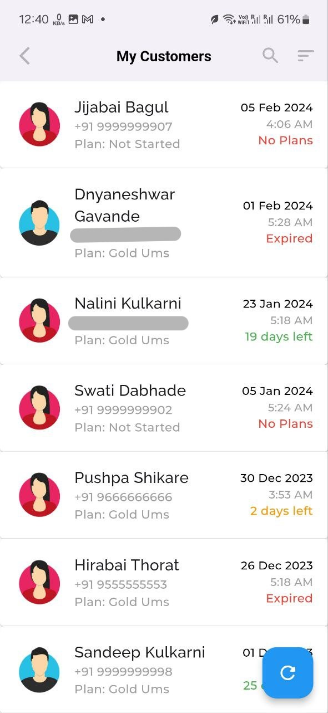

### Customer Details
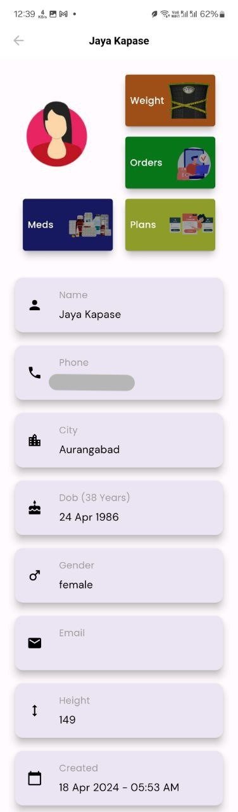

### Customer Measurements
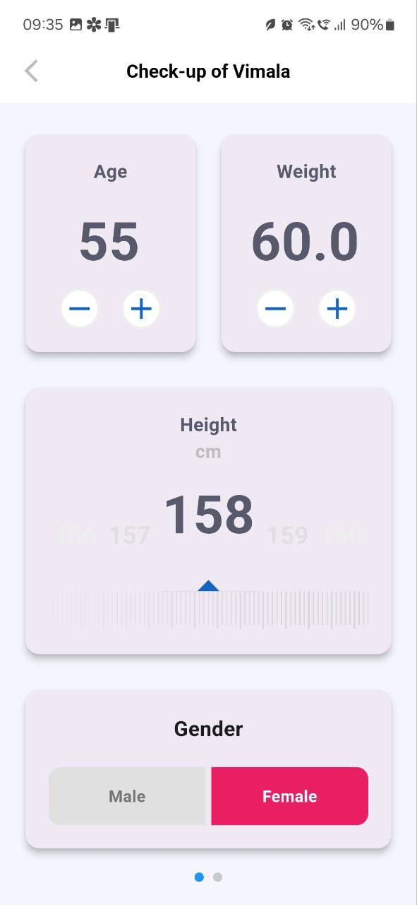

### Customer Plans
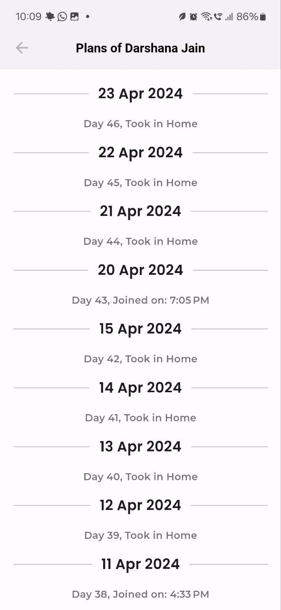

### Customer Order Billing
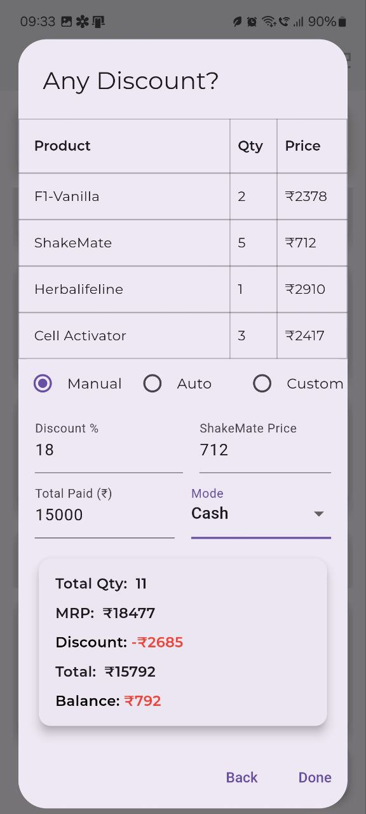

### Customer Orders & Invoices
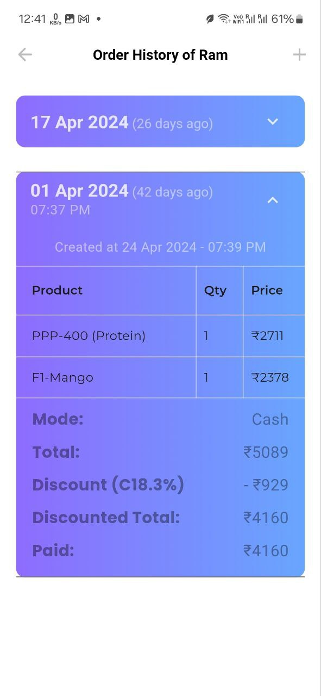

## Feedback

I welcome your feedback and suggestions. Please feel free to reach out to me at [Raunak Email](mailto:raunak200308@gmail.com) with any questions or comments.

## License

This project is strictly only for educational purposes and not for commercial use. All rights reserved by the [owner](https://www.raunak.me) of this project.

```
Thank you for using CoachZen! 🙏🏼
```


